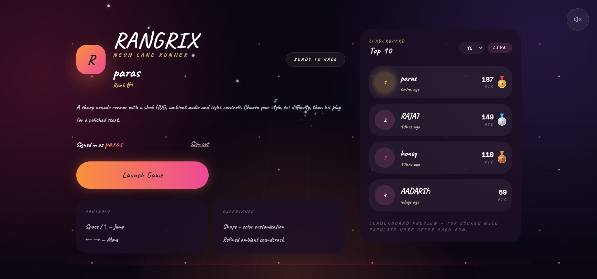

<div align="center">

# 🎮 RANGRIX 🎮

**A neon arcade lane runner featuring live leaderboards, player customization.**



</div>

---

## ✨ Features

- 🎨 Player color and shape customization
- 🔐 User authentication with persistent sessions
- 🏆 Live leaderboard
- 🎉 Top-3 rank celebration animations
- 🎵 Optional music and sound effects

---

## 🚀 Run Locally

### Backend

```bash
cd Backend
npm install
npm start
```

### Frontend

```bash
cd Frontend
npm install
npm run dev
```

Frontend: `http://localhost:5173`  
Backend: `http://localhost:5000`

---

## 🎯 Controls

| Action | Key |
|--------|-----|
| Jump | `Space` / `↑` |
| Move | `←` `→` |

---

## 🛠️ Tech Stack

- **Frontend:** React, TypeScript, Vite
- **Backend:** Node.js, Express
- **Database:** MongoDB

---

<div align="center">

Made with ❤️ by Rajat Semwal

</div>
